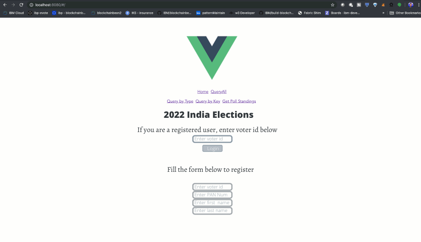
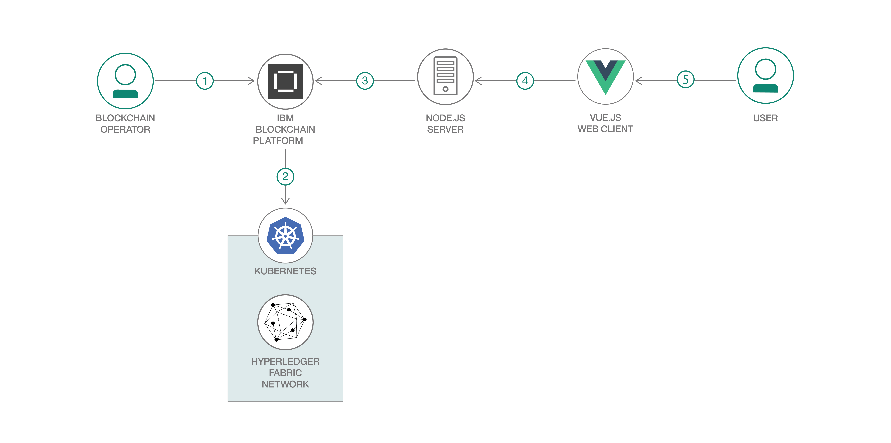
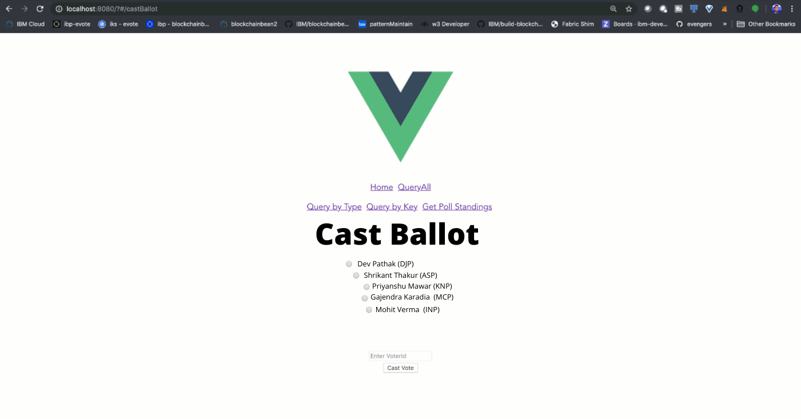
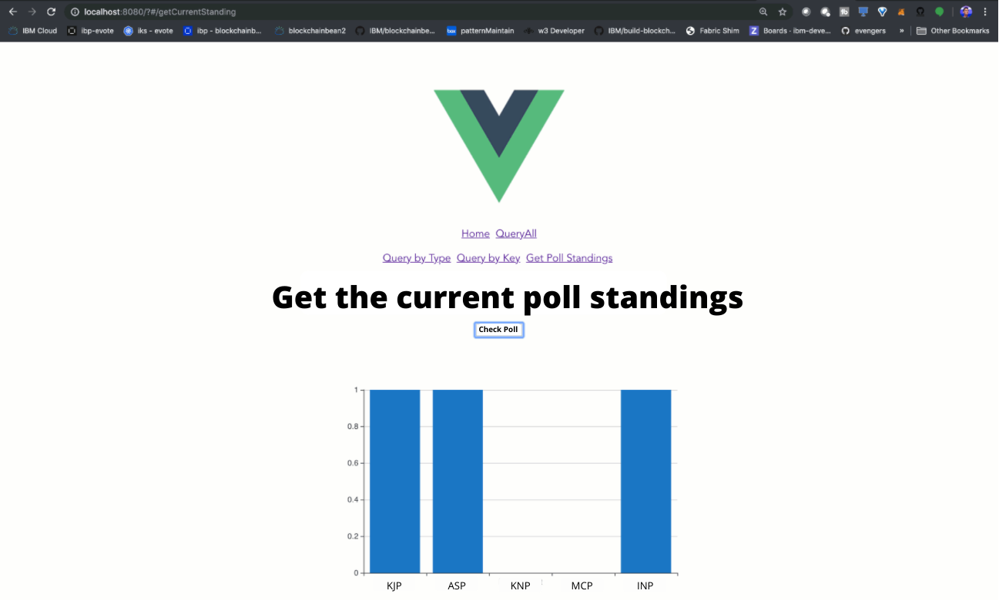

## a fair evoting application to ensure correct election results with Hyperledger Fabric and IBM Blockchain Platform

 

  

 

Have you ever wondered how exactly the votes in a presidential election 
counted? What if instead of having volunteers that are spending hours a 
day counting votes manually, we have an app that was backed by blockchain, 
recording each vote made by a voter, ensuring double-voting is not possible?
That's what this code pattern explains how to do. We aim to build a web-app
in which the voter can register with their drivers license, get a unique 
voterId which is used to login to the app, and cast the vote. The vote is 
tallied on the blockchain, and the web-app shows the current standings of the
polls. 

### Voting using Public Key Infrastructure
At the start of the application, the user registers to vote by providing their drivers license number, registrar district, and first and last name. In this step, we can check to see if the drivers license is valid, and has not been registered previously. If all goes well, we create a private and public key for the voter with our certificate authority that is running on the cloud, and add those keys to the wallet. 

### Architecture and description
 

  

 

Flow Description:
1.	The blockchain operator sets up the IBM Blockchain Platform 2.5 service.
2.	The IBM Blockchain Platform 2.5 creates a Hyperledger Fabric network on an IBM Kubernetes Service, and the operator installs and instantiates the smart contract on the network.
3.	The Node.js application server uses the Fabric SDK to interact with the deployed network on IBM Blockchain Platform 2.5 and creates APIs for a web client.
4.	The Vue.js client uses the Node.js application API to interact with the network.
5.	The user interacts with the Vue.js web interface to cast their ballot and query the world state to see current poll standings.

 

  

 
 
 

  

 